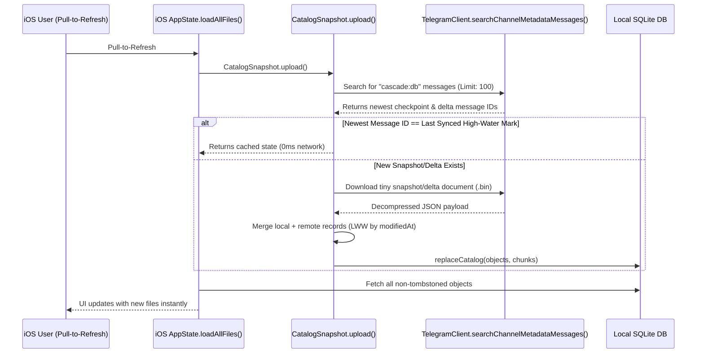
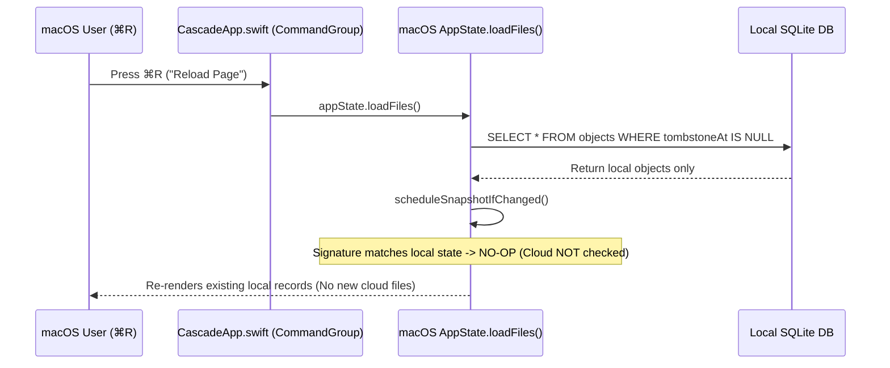

# File Sync Architecture & macOS/iOS Sync Parity

> **Reference Document**: Details the current cloud catalog synchronization architecture on Cascade, analyzes the discrepancy between iOS pull-to-refresh and macOS ⌘R / Settings Sync, and specifies the implementation plan to unify fast snapshot-based sync across both platforms.

---

## 1. Overview & Problem Statement

### The User-Observed Discrepancy
- **On iOS**: Pulling down to refresh (`.refreshable`) uses the modern **search-based snapshot sync**. It queries Telegram's server for `cascade:db*` metadata messages in under 1 second, checks the high-water mark, downloads only new snapshots or deltas, performs a Last-Write-Wins (CRDT-style) merge into SQLite, and instantly displays newly uploaded files from the cloud.
- **On macOS (`⌘R` / Reload Page)**: Pressing `⌘R` only queries the **local SQLite database** (`appState.loadFiles()`). It does not query the Telegram channel for new cloud snapshots or deltas. As a result, files uploaded from other devices (like iOS) do not appear upon pressing `⌘R`.
- **On macOS (Settings "Sync Now")**: The "Sync Now" button in Settings checks if the local database has existing records (`before == 0`). If the database is already populated (`before > 0`), it skips snapshot restore and runs `VaultRepair.run()`, which falls back to the legacy technique of paginating through thousands of channel messages.

---

## 2. Deep Dive: Current Sync Implementations

### A. iOS Sync Flow (Modern Fast Snapshot Sync)
**Trigger**: Pull-to-refresh in `FileBrowserView.swift`, page navigation, or startup.



**Code Path**:
1. `Cascade iOS/AppState.swift:348-360`:
   ```swift
   func loadAllFiles(reconcileCloud: Bool = true) async {
       if reconcileCloud && TelegramClient.shared.isAuthorized,
          let vault = try? await DatabaseManager.shared.firstVault() {
           _ = await CatalogSnapshot.upload()
       }
       let objects = try await DatabaseManager.shared.allObjects()
       self.allFiles = objects.map { FileItem(record: $0) }
       self.files = currentFiles
   }
   ```
2. `Storage/CatalogSnapshot.swift:94-140`:
   - Calls `fetchChannelState(chatId: vault.channelID)`.
   - Uses `TelegramClient.shared.searchChannelMetadataMessages(chatId: chatId, query: "cascade:db")`.
   - Compares `newestSeenID` against `UserDefaults` key `xc.lastSyncedMsgID.<chatId>`.
   - Reconciles and adopts the merged catalog via `DatabaseManager.shared.replaceCatalog`.

---

### B. macOS `⌘R` Flow (Local-Only Reload)
**Trigger**: Pressing `⌘R` or selecting "Reload Page" from the View menu.



**Code Path**:
1. `App/CascadeApp.swift:89-97`:
   ```swift
   CommandGroup(after: .toolbar) {
       Button("Reload Page") {
           Task {
               await appState.loadFiles()
               appState.thumbnailVersion += 1
           }
       }
       .keyboardShortcut("r", modifiers: .command)
   }
   ```
2. `App/AppState.swift:298-327`:
   ```swift
   @MainActor
   func loadFiles() async {
       do {
           let objects = try await DatabaseManager.shared.allObjects().filter { $0.tombstoneAt == nil }
           self.files = objects.sorted { ... }
       } catch { ... }
       await scheduleSnapshotIfChanged()
   }
   ```
3. `App/AppState.swift:332-348`:
   `scheduleSnapshotIfChanged()` checks `currentCatalogSignature() == lastSnapshotSignature`. If the Mac didn't modify files locally, it exits immediately and never checks Telegram.

---

### C. macOS Settings "Sync Now" Flow (Legacy Channel Scan)
**Trigger**: Clicking "Sync Now" in Settings.

**Code Path**:
`App/AppState.swift:1199-1233`:
```swift
@MainActor
func syncNow() async {
    ...
    let before = ((try? await DatabaseManager.shared.allObjects()) ?? []).count
    let restored: Bool
    if before == 0 {
        restored = await CatalogSnapshot.restore()
    } else {
        restored = false
    }
    if restored {
        await self.loadFiles()
        alertMessage = "Sync complete — catalog restored instantly from the cloud snapshot."
    } else {
        // FALLBACK: Full channel pagination over all chunk messages
        let messages = await TelegramClient.shared.allChannelMessages(chatId: vault.channelID, usingCache: true)
        let changed = await VaultRepair.run()
        await self.loadFiles()
        alertMessage = "Sync complete — \(messages.count) messages in the channel..."
    }
    await forcePublishSnapshot()
}
```
**Problem**: Because `before` is almost always `> 0` on an active Mac, `syncNow()` always takes the slow `VaultRepair.run()` branch instead of reconciling snapshots with `CatalogSnapshot.upload()`.

---

## 3. The Unification Plan

To achieve feature parity and sub-second sync across both platforms:

### 1. Update `loadFiles(reconcileCloud:)` on macOS
Add cloud reconciliation capability to macOS `AppState.loadFiles`:
```swift
@MainActor
func loadFiles(reconcileCloud: Bool = false) async {
    if reconcileCloud && TelegramClient.shared.isAuthorized {
        _ = await CatalogSnapshot.upload()
    }
    do {
        let objects = try await DatabaseManager.shared.allObjects().filter { $0.tombstoneAt == nil }
        self.files = objects.sorted { ... }
    } catch { ... }
}
```

### 2. Wire `⌘R` ("Reload Page") to Reconcile Cloud
In `App/CascadeApp.swift:90-97`:
```swift
CommandGroup(after: .toolbar) {
    Button("Reload Page") {
        Task {
            await appState.loadFiles(reconcileCloud: true)
            appState.thumbnailVersion += 1
        }
    }
    .keyboardShortcut("r", modifiers: .command)
}
```
When the user presses `⌘R` on macOS, it will execute the exact same fast server-side snapshot search and LWW merge as iOS pull-to-refresh.

### 3. Modernize Settings "Sync Now" on macOS
Update `syncNow()` in `App/AppState.swift:1199`:
1. First, attempt `CatalogSnapshot.upload()` (which reconciles remote checkpoints/deltas and merges them with local state).
2. If `CatalogSnapshot.upload()` succeeds, update files and notify the user that the catalog was synced in $< 1$ second.
3. Keep `VaultRepair.run()` strictly as a secondary manual option (e.g. "Deep Catalog Repair") for catastrophic recovery when metadata messages are missing or corrupted.

### 4. Window Focus / App Activation Sync
When the macOS app becomes active (`NSApplication.didBecomeActiveNotification`), trigger a background `loadFiles(reconcileCloud: true)`. Because of the `xc.lastSyncedMsgID` high-water mark check, if no new files were uploaded, the check completes in $< 100$ms with zero UI disruption.

---

## 4. Summary Table

| Feature | iOS App | macOS App (Current) | macOS App (Target) |
| :--- | :--- | :--- | :--- |
| **Refresh Trigger** | Pull-to-refresh (`.refreshable`) | `⌘R` (View $\rightarrow$ Reload Page) | `⌘R` (View $\rightarrow$ Reload Page) |
| **Sync Method** | Server-side metadata search (`searchChannelMetadataMessages`) | Local SQLite query only | Server-side metadata search (`CatalogSnapshot.upload()`) |
| **Sync Duration** | $< 1$ second | $< 10$ ms (local only, no cloud update) | $< 1$ second (complete cloud reconcile) |
| **Settings Sync** | N/A (automatic) | Message-by-message `VaultRepair.run()` | Fast snapshot reconcile $\rightarrow$ `VaultRepair` fallback |
| **Merge Strategy** | Last-Write-Wins (CRDT timestamp) | None on reload | Last-Write-Wins (CRDT timestamp) |
