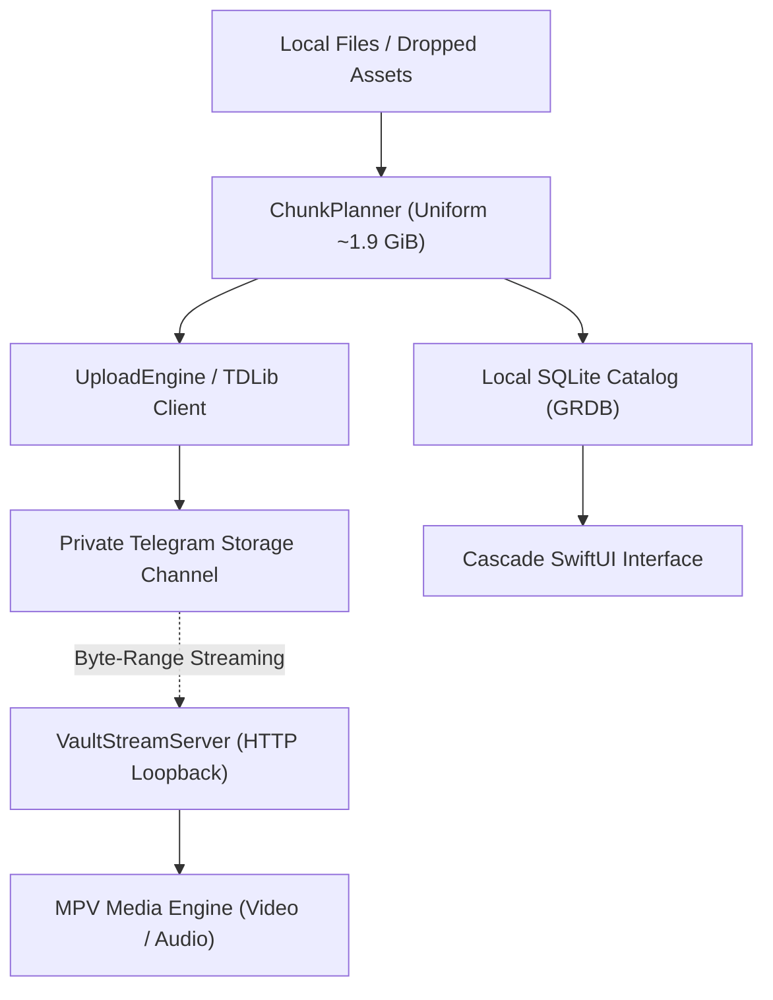

<p align="center">
  
</p>

<h1 align="center">Cascade</h1>

<p align="center">
  <strong>Fast, native personal cloud storage and media streaming client for macOS.</strong>
</p>

<p align="center">
  <a href="#features">Features</a> •
  <a href="#architecture">Architecture</a> •
  <a href="#installation">Installation</a> •
  <a href="#building-from-source">Building</a> •
  <a href="#security--privacy">Security & Privacy</a> •
  <a href="#license">License</a>
</p>

---

## Overview

**Cascade** is a native macOS personal cloud storage client engineered for speed, fluid navigation, and instant media playback. It connects to your Telegram account via open TDLib/MTProto protocol to serve as a personal file drive and media streamer.

Files are cataloged locally in high-performance SQLite storage and uploaded using uniform **~1.9 GiB chunks**, engineered specifically to fit comfortably beneath the 2 GB document upload limit while minimizing message overhead and maximizing transfer throughput.

---

## Features

- 🎬 **Native MPV Media Engine**  
  Built-in custom `libmpv` media pipeline for hardware-accelerated playback of 4K HDR (AV1, HEVC, H.264), lossless audio (FLAC, ALAC, Opus), and advanced subtitle rendering (ASS/SSA, SRT, VTT).

- ⚡️ **Instant Byte-Range Cloud Streaming**  
  Stream videos and audio files directly from your cloud storage without waiting for full downloads. Cascade's internal loopback HTTP range server (`VaultStreamServer`) serves virtual byte ranges directly to the media engine for zero-wait seeking and scrubbing.

- 📦 **Uniform ~1.9 GiB Chunking**  
  Large files are partitioned into uniform ~1.9 GiB chunks, maximizing Telegram's single-document ceiling while minimizing message count. Small and medium files under 1.9 GiB upload as single, intact documents. Resumes are handled reliably at internal part granularity via TDLib.

- 🔍 **Finder-Grade Across-App Search**  
  Search instantly across all folders, subfolders, media categories, books, and documents. Includes Finder-style scope toggling (`Everywhere` vs. `Current Folder`), breadcrumb path tags, and "Show in Enclosing Folder".

- 🛡️ **Private Vault**  
  A dedicated locked partition protected by Touch ID, Face ID, or a master PIN. Hidden from the main library and search until explicitly unlocked. PIN verification is backed by PBKDF2-HMAC-SHA256 (600,000 iterations) with exponential attempt backoff.

- 📚 **Integrated Readers & Collections**  
  Built-in EPUB and PDF reader with reading progress tracking, alongside smart categories for **Photos**, **Videos**, **Audio**, **Documents**, and **Books**.

- 📝 **Integrated Notes**  
  A fast, lightweight note-taking space with Markdown preview, auto-detected links, and tag filtering.

- 💾 **Adaptive Offline Cache & Pinning**  
  Mark files or entire folders with **"Keep Downloaded"** for offline access. The engine includes an adaptive LRU cache that respects system disk pressure.

- 🔄 **Over-the-Air Updates (Sparkle 2)**  
  Built-in seamless automatic updates powered by Sparkle 2 with Ed25519 cryptographic signature verification. Check for updates directly from the app menu or Settings.

- 🎨 **Liquid Glass macOS Interface**  
  Engineered specifically for macOS with interactive liquid glass controls, dynamic dark/light Dock tile switching, and keyboard navigation. Automatically adapts to standard translucent system materials on any display or hardware profile.

---

## Architecture



- **Chunk Management**: `ChunkPlanner` determines document boundaries with a uniform `1,900 MiB` safe ceiling.
- **Transfer Engines**: `UploadEngine` and `DownloadEngine` manage concurrent transfers, TDLib-backed resumes, and automatic network retry.
- **Local Catalog**: Stored in a local SQLite database via **GRDB**, providing instant search, tagging, folder hierarchy navigation, and offline metadata access.
- **Streaming Pipeline**: `VaultStreamServer` serves virtual HTTP byte ranges straight into `libmpv`, enabling instant scrubbing through multi-gigabyte media without downloading the whole file.

---

## Installation

### Pre-built DMG (Beta)

Download the latest release disk image from the [Releases](https://github.com/entanglon/cascade/releases) page:

1. Download **`Cascade-1.2.0.dmg`**.
2. Open the disk image and drag **Cascade** to your **Applications** folder.
3. Launch Cascade. On first launch, connect your Telegram account via QR code or phone number.

---

## Building from Source

### Prerequisites

- macOS 15.0 or later
- Xcode 16.0 or later with Command Line Tools
- [create-dmg](https://github.com/create-dmg/create-dmg) (optional, for packaging installer disk images)

```bash
# Clone the repository
git clone https://github.com/entanglon/cascade.git
cd cascade

# Build the Debug scheme
xcodebuild -project Cascade.xcodeproj -scheme Cascade -destination 'platform=macOS' build

# Build the Release DMG package
bash scripts/make_dmg.sh 1.2.0
```

---

## Security & Privacy

1. **Keychain Storage**: Telegram credentials and vault authentication credentials are stored locally in the macOS Keychain using `kSecAttrAccessibleWhenUnlockedThisDeviceOnly`.
2. **Biometric Protection**: Vault unlock uses the LocalAuthentication framework (Touch ID / Face ID) backed by the Secure Enclave, with exponential backoff on repeated PIN failures.
3. **Hardened Runtime**: Built with macOS Hardened Runtime enabled for code-signing tamper resistance.

---

## License

Cascade is released under the [MIT License](LICENSE).
