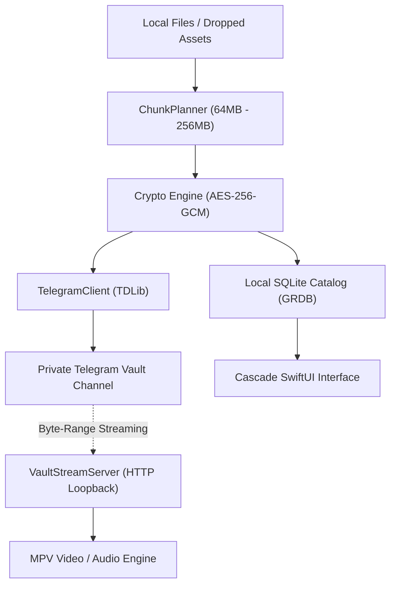

<p align="center">
  
</p>

<h1 align="center">Cascade</h1>

<p align="center">
  <strong>Zero-knowledge, client-side encrypted cloud storage with native media streaming, powered by Telegram.</strong>
</p>

<p align="center">
  <a href="#features">Features</a> •
  <a href="#architecture">Architecture</a> •
  <a href="#installation">Installation</a> •
  <a href="#building-from-source">Building</a> •
  <a href="#security">Security</a> •
  <a href="#license">License</a>
</p>

---

## Overview

**Cascade** is a native macOS cloud storage client engineered for speed, privacy, and media performance. It leverages Telegram's distributed infrastructure as an unlimited, durable storage layer while maintaining strict **zero-knowledge, client-side encryption**. 

Your files are chunked, encrypted, and cataloged locally before uploading. Telegram only ever sees opaque, encrypted ciphertext.

---

## Features

- 🔐 **Zero-Knowledge Encryption**  
  Every file, chunk, and thumbnail is encrypted client-side using **AES-256-GCM** with keys managed via the macOS Keychain. Telegram has zero access to your filenames, metadata, or file content.

- 🎬 **Native MPV Media Engine**  
  Built with a custom libmpv engine for hardware-accelerated playback of 4K HDR (AV1, HEVC, H.264), lossless audio (FLAC, ALAC, Opus), and advanced subtitle rendering (ASS/SSA, SRT, VTT).

- ⚡️ **Instant Byte-Range Cloud Streaming**  
  Stream videos and music directly from the cloud without waiting for full downloads, powered by an internal loopback HTTP range server.

- 🔍 **Finder-Grade Across-App Search**  
  Search instantly across all folders, subfolders, media categories, books, and documents. Includes Finder-style scope toggling (`Everywhere` vs. `Current Folder`), breadcrumb path tags, and "Show in Enclosing Folder".

- 🛡️ **Private Vault**  
  A dedicated locked partition protected by Touch ID, Face ID, or a master PIN. Hidden from the main library and search until explicitly unlocked.

- 📚 **Integrated Readers & Collections**  
  Built-in EPUB and PDF reader with reading progress tracking, alongside smart categories for **Photos**, **Videos**, **Audio**, **Documents**, and **Books**.

- 📝 **Encrypted Notes**  
  A fast, Google Keep-style encrypted note-taking space with Markdown preview, auto-detected links, and tag filtering.

- 💾 **Adaptive Offline Cache & Pinning**  
  Mark files or entire folders with **"Keep Downloaded"** for offline access. The engine includes an adaptive LRU cache that respects system disk pressure.

- 🎨 **Liquid Glass macOS Interface**  
  Engineered specifically for macOS with interactive liquid glass controls, dynamic dark/light Dock tile switching, and keyboard navigation.

---

## Architecture



- **Transfer Engines**: `UploadEngine` and `DownloadEngine` manage concurrent chunk transfers, resume on interrupt, and handle automatic retry on network changes.
- **Local Catalog**: Stored in an encrypted SQLite database via **GRDB**, syncing metadata snapshots back to the vault channel for cross-device consistency.
- **Streaming Pipeline**: `VaultStreamServer` serves virtual HTTP byte ranges straight into `libmpv`, providing scrub scrubbing without downloading multi-gigabyte files.

---

## Installation

### Pre-built DMG (Beta)

Download the latest release disk image from the [Releases](https://github.com/entanglon/cascade/releases) page:

1. Download **`Cascade-1.2.0.dmg`**.
2. Open the disk image and drag **Cascade** to your **Applications** folder.
3. Launch Cascade. On first launch, connect your Telegram account via QR code or phone number.

---

## Building from Source

### Prerequisites

- macOS 14.0 or later
- Xcode 16.0 or later with Command Line Tools
- [create-dmg](https://github.com/create-dmg/create-dmg) (optional, for packaging installer disk images)

```bash
# Clone the repository
git clone https://github.com/entanglon/cascade.git
cd cascade

# Build the Debug scheme
xcodebuild -project Cascade.xcodeproj -scheme Cascade -destination 'platform=macOS' build

# Build the Release DMG package
bash scripts/make_dmg.sh 1.2.0
```

---

## Security Model

1. **Client-Side Only**: Cryptographic keys are generated locally on device and stored securely in the macOS Keychain.
2. **Encrypted at Rest**: All file chunks, catalog snapshots, and thumbnail sidecars uploaded to Telegram channels are encrypted with authenticated AES-256-GCM.
3. **Biometric Protection**: Vault unlock relies on the LocalAuthentication framework (Touch ID / Face ID) backed by the Secure Enclave.
4. **Hardened Runtime**: Ships with macOS Hardened Runtime enabled for tamper resistance.

---

## License

Cascade is released under the [MIT License](LICENSE).
