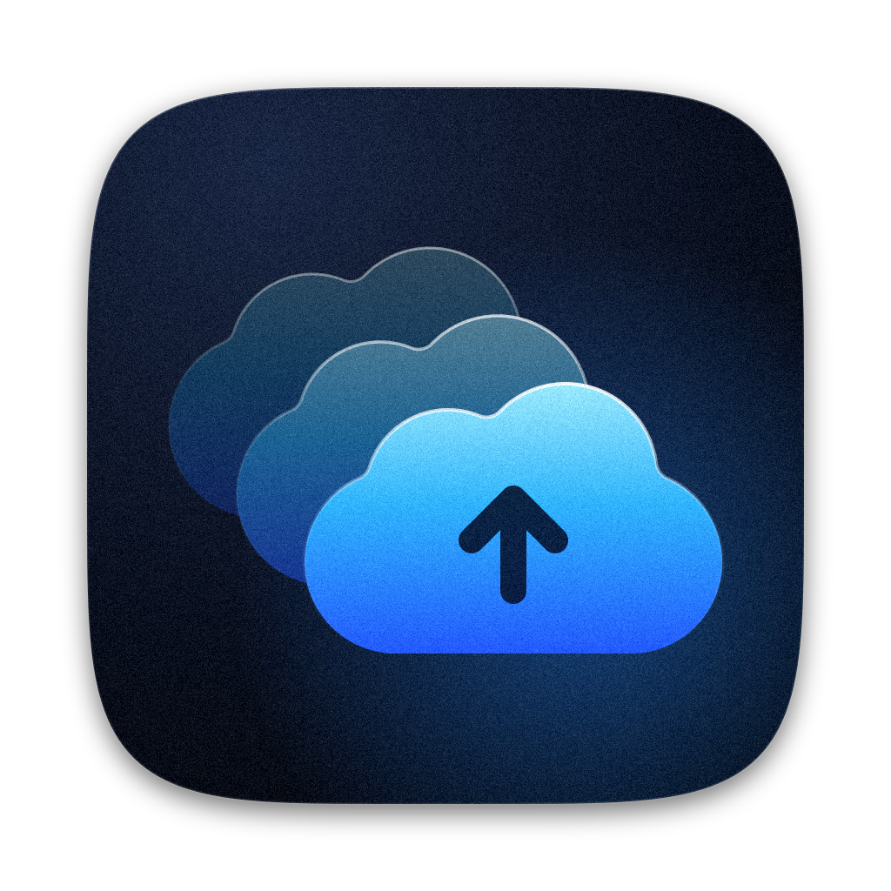
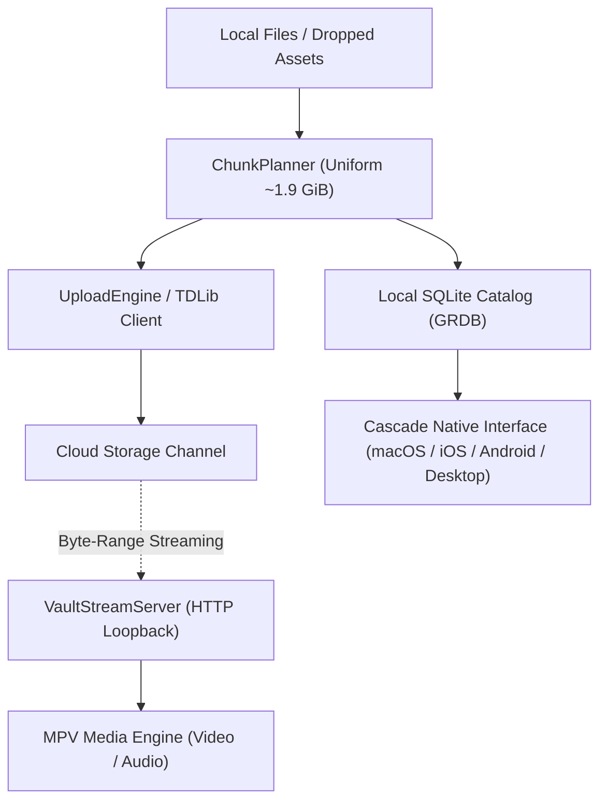

<p align="center">
  
</p>

<h1 align="center">Cascade</h1>

<p align="center">
  <strong>Unified, high-performance personal cloud storage and media streaming suite.</strong>
</p>

<p align="center">
  <a href="#platform-support">Platforms</a> •
  <a href="#features">Features</a> •
  <a href="#architecture">Architecture</a> •
  <a href="#installation">Installation</a> •
  <a href="#building-from-source">Building</a> •
  <a href="#security--privacy">Security & Privacy</a> •
  <a href="#license">License</a>
</p>

---

## Overview

**Cascade** is a modern, cross-platform personal cloud drive and high-performance media streaming suite engineered for speed, fluid navigation, and instant 4K HDR playback. Connecting to your personal cloud via open MTProto/TDLib protocol, Cascade transforms your cloud account into an unlimited, structured file drive, multimedia library, and secure digital vault across desktop and mobile devices.

Files are cataloged locally in high-performance SQLite storage and transferred using uniform **~1.9 GiB chunking**, engineered to fit comfortably beneath single-document upload ceilings while minimizing message overhead and maximizing transfer throughput.

---

## 📱 Platform Support & Availability

Cascade is designed natively for each operating system:

| Platform | Status | Distribution | Minimum Version | Architecture |
| :--- | :--- | :--- | :--- | :--- |
| **macOS** | **Public Beta (Available Now)** | [DMG (Direct)](https://github.com/entanglon/cascade/releases) / Sparkle OTA | macOS 15.0+ | Universal (`arm64` + `x86_64`) |
| **iOS / iPadOS** | *Launching Tomorrow* | TestFlight / IPA | iOS 17.0+ | `arm64` |
| **Android** | *Launching Tomorrow* | APK / Google Play | Android 10+ (API 29+) | `arm64-v8a`, `armeabi-v7a`, `x86_64` |
| **Windows** | *Launching Tomorrow* | MSIX / Installer | Windows 10 / 11 | `x64`, `ARM64` |
| **Linux** | *Launching Tomorrow* | AppImage / Flatpak | Modern Distributions | `x86_64`, `aarch64` |

---

## Features

- 🎬 **Native MPV Media Engine**  
  Built-in custom `libmpv` media pipeline for hardware-accelerated playback of 4K HDR (AV1, HEVC, H.264), lossless audio (FLAC, ALAC, Opus), and advanced subtitle rendering (ASS/SSA, SRT, VTT).

- ⚡️ **Instant Byte-Range Cloud Streaming**  
  Stream high-bitrate videos and audio files directly from your cloud storage without waiting for full downloads. Cascade's internal loopback HTTP range server (`VaultStreamServer`) serves virtual byte ranges directly to the media engine for zero-wait seeking and scrubbing.

- 📦 **Uniform ~1.9 GiB Chunking**  
  Large files are partitioned into uniform ~1.9 GiB chunks, maximizing single-document upload ceilings while minimizing message count. Small and medium files under 1.9 GiB upload as single, intact documents. Upload and download resumption is handled reliably at internal part granularity via TDLib.

- 🔍 **Across-App Global Search**  
  Search instantly across all folders, subfolders, media categories, books, and documents. Includes scope toggling (`Everywhere` vs. `Current Folder`), breadcrumb path tags, and "Show in Enclosing Folder".

- 🛡️ **Biometric Private Vault**  
  A dedicated locked partition protected by biometric authentication (Touch ID, Face ID, Fingerprint) or master PIN. Hidden from the main library and search until explicitly unlocked. PIN verification is backed by PBKDF2-HMAC-SHA256 (600,000 iterations) with exponential attempt backoff.

- 📚 **Integrated Readers & Collections**  
  Built-in EPUB and PDF reader with reading progress tracking, alongside smart categories for **Photos**, **Videos**, **Audio**, **Documents**, and **Books**.

- 📝 **Integrated Notes**  
  Fast, lightweight note-taking space with Markdown preview, auto-detected links, and tag filtering.

- 💾 **Adaptive Offline Cache & Pinning**  
  Mark files or entire folders with **"Keep Downloaded"** for offline access. The engine includes an adaptive LRU cache that respects system disk pressure.

- 🔄 **Over-the-Air (OTA) Updates**  
  Built-in seamless automatic updates. On macOS, updates are powered by Sparkle 2 with Ed25519 cryptographic signature verification, available directly from the app menu or Settings.

- 🎨 **Adaptive Platform-Native Design**  
  Engineered natively for each platform—featuring liquid glass materials and vibrancy on macOS and iOS, Material You on Android, and Fluent styling on Windows. Automatically adapts to standard translucent system materials on any display or hardware profile.

---

## Architecture



- **Chunk Management**: `ChunkPlanner` determines document boundaries with a uniform `1,900 MiB` safe ceiling.
- **Transfer Engines**: `UploadEngine` and `DownloadEngine` manage concurrent transfers, TDLib-backed resumes, and automatic network retry.
- **Local Catalog**: Stored in a local SQLite database via **GRDB**, providing instant search, tagging, folder hierarchy navigation, and offline metadata access.
- **Streaming Pipeline**: `VaultStreamServer` serves virtual HTTP byte ranges straight into `libmpv`, enabling instant scrubbing through multi-gigabyte media without downloading the whole file.

---

## Installation

### macOS (Beta Available Now)

Download the latest release disk image from the [Releases](https://github.com/entanglon/cascade/releases) page:

1. Download **`Cascade-1.2.0.dmg`**.
2. Open the disk image and drag **Cascade** to your **Applications** folder.
3. Launch Cascade. On first launch, connect your account via QR code or phone number.

> **Note for macOS Gatekeeper**: Because this is a developer beta build, if macOS displays an unidentified developer prompt on first launch, right-click (or Control-click) `Cascade.app` in Applications and select **Open**.

### iOS, Android, Windows & Linux (Launching Tomorrow)

The releases for iOS, Android, Windows, and Linux will be published tomorrow. Pre-built packages (`.ipa` / TestFlight, `.apk`, `.msix`, and `.AppImage`) will be available directly on the [Releases](https://github.com/entanglon/cascade/releases) page and relevant platform app stores.

---

## Building from Source

### macOS

**Prerequisites**:
- macOS 15.0 or later
- Xcode 16.0 or later with Command Line Tools
- [create-dmg](https://github.com/create-dmg/create-dmg) (optional, for packaging installer disk images)

```bash
# Clone the repository
git clone https://github.com/entanglon/cascade.git
cd cascade

# Build the Debug scheme
xcodebuild -project Cascade.xcodeproj -scheme Cascade -destination 'platform=macOS' build

# Build the Release DMG package
bash scripts/make_dmg.sh 1.2.0
```

---

## Security & Privacy

1. **Hardware-Backed Credential Storage**: Account credentials and vault authentication tokens are stored securely in platform-native credential storage (Keychain on macOS/iOS, Keystore on Android, Credential Locker on Windows, Secret Service on Linux).
2. **Biometric Protection**: Vault unlock uses hardware biometric sensors (Touch ID, Face ID, BiometricPrompt) backed by the device's Secure Enclave / TEE, with exponential backoff on repeated PIN failures.
3. **Hardened Runtime**: Built with macOS Hardened Runtime enabled for code-signing tamper resistance.

---

## License

Cascade is released under the [MIT License](LICENSE).
